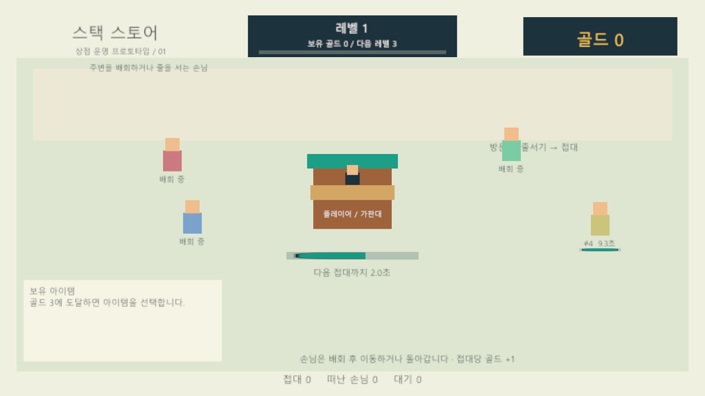
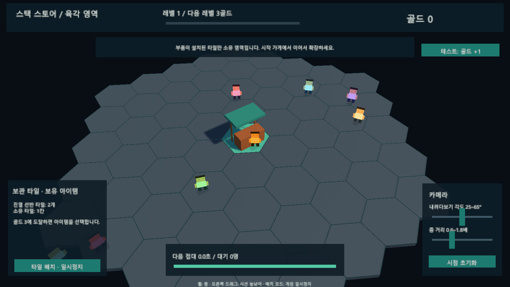
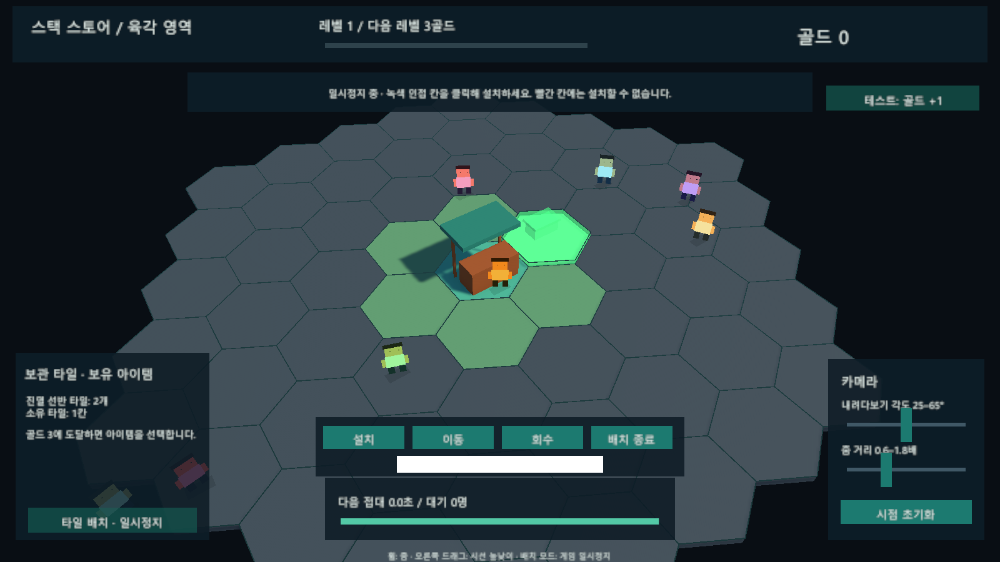
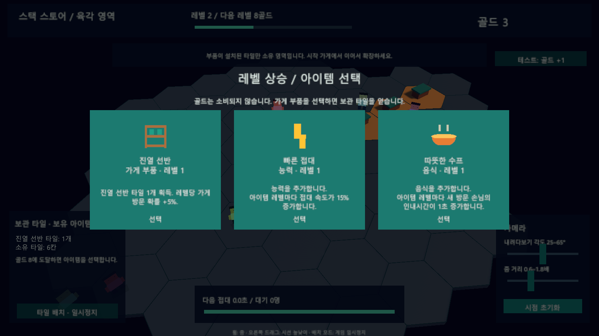
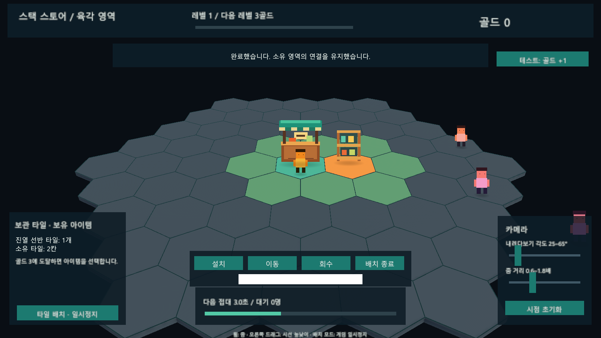
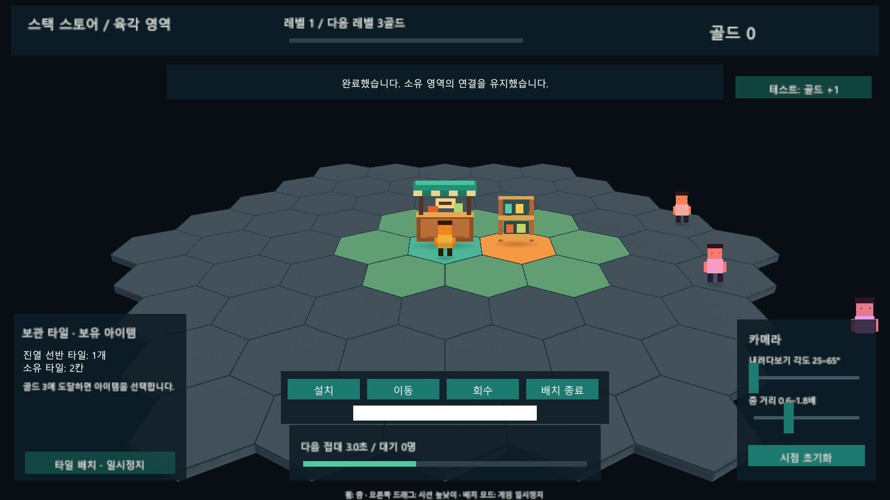
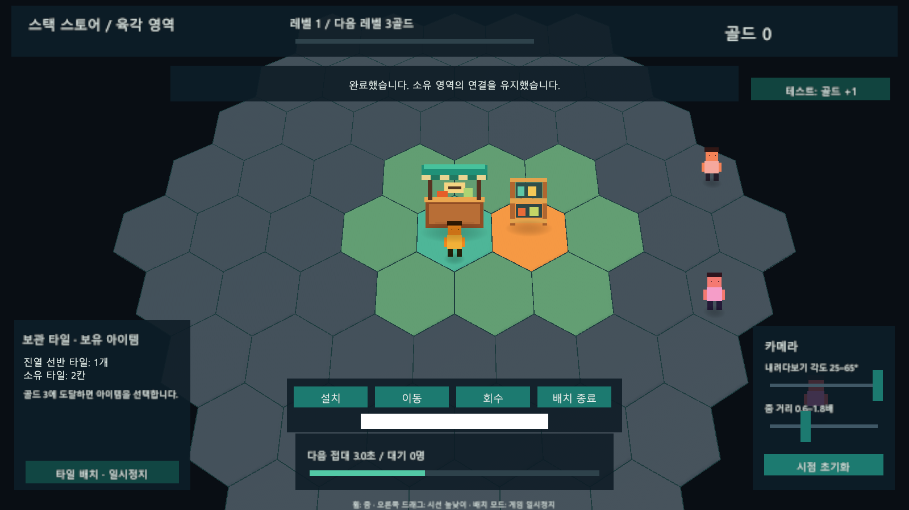
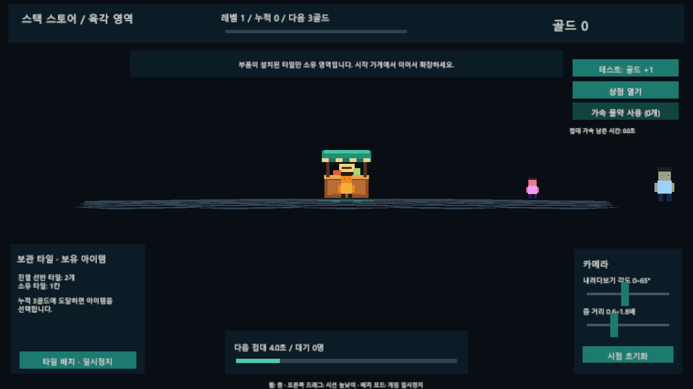
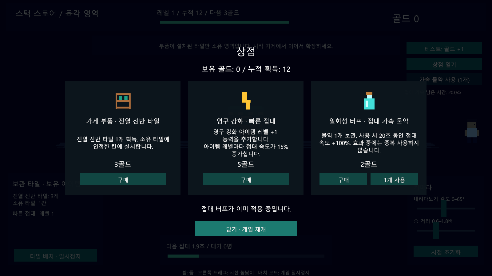

# 프로토타입 비교

- **새 육각 버전**: `HexWorld/Scenes/HexWorld.unity` — 3D 바닥, 2D 캐릭터, 소유 영역 확장, 배치·이동·회수. [테스트 안내](HexWorld/Guide.md)
- **기존 UGUI 버전**: `LegacyUGUI/Scenes/SampleScene.unity` — 이전 화면과 플레이 동작 보존. [기존 안내](LegacyUGUI/StackStorePrototype-Guide.md)
- **공용 코드**: `Shared` — 문자열 조회, 폰트, 아이템 정의와 골드 곡선. 기존 버전 삭제 시에도 유지합니다.

기존 자산의 GUID를 유지한 채 폴더를 이동했습니다. 새 씬의 자산 의존성에는 LegacyUGUI가 없습니다. 추후 기존 버전을 삭제할 때는 Unity에서 LegacyUGUI 폴더를 삭제하고 Build Settings에서 해당 씬 항목을 제거합니다.

이전 화면과 새 단계별 화면은 각 버전의 Documentation 폴더에 보관합니다. 실제 그래픽은 임시 자산이며, 화면 구성의 변화를 비교하기 위한 기록입니다.

2026-10-05 수정: 캐릭터·건물을 모두 2D로 구성하고 가게 정면에서 시작합니다. 그림의 비율은 유지하고 바닥의 시선 각도만 바뀝니다.

2026-10-05 추가: 수평 정면까지 카메라 하강, 타일 윤곽 표시, 보유 골드를 소비하는 상점. 누적 획득 골드로 레벨업 진행을 유지합니다.

